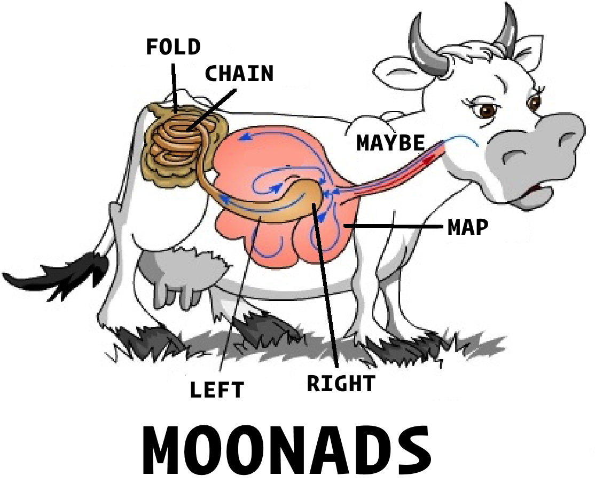

# moonads

Typescript monads implemented in an object oriented style. Because I have a weird sense of humour.

This is a personal learning exercise and is totally incomplete. Don't use it; I'm not supporting it.

TODO
* [x] Either
* [ ] Future
* [ ] IO
* [ ] List
* [x] Rename callback -> transform
* [x] readonly all the things.
* [ ] Monad rules?